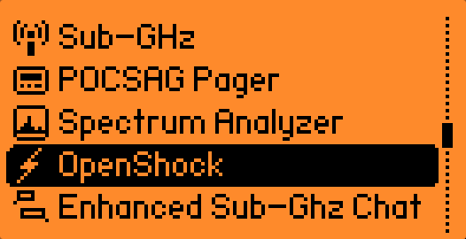
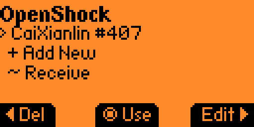
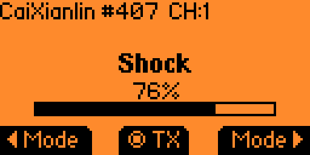
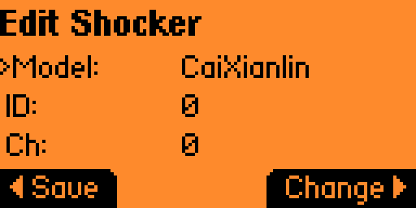
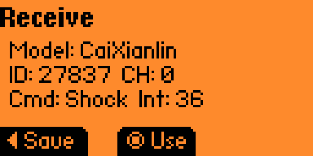

# OpenShock Flipper Zero

A [Flipper Zero](https://flipperzero.one/) application for controlling [OpenShock](https://openshock.org/) compatible shockers over 433 MHz.



## Features

- **Transmit** — send commands to any supported shocker by configuring model, ID, channel, command type, and intensity. Hold OK to transmit continuously.
- **Receive** — listen for 433 MHz OOK transmissions and automatically decode shocker commands from any supported protocol.
- **Save/Load** — save shocker configurations to the SD card for quick access. Save directly from the receive screen after capturing a transmission.

| Main Menu | Transmit | Edit | Receive |
|:---------:|:--------:|:----:|:-------:|
|  |  |  |  |

## Supported Shockers

| Model | Commands |
|-------|----------|
| CaiXianlin | Shock, Vibrate, Sound, Light |
| Petrainer | Shock, Vibrate, Sound |
| Petrainer 998DR | Shock, Vibrate, Sound, Light |
| Wellturnt T330 | Shock, Vibrate, Sound |
| D80 | Shock, Vibrate, Sound |

## Installation

### From the Flipper Apps Catalog

Search for "OpenShock" in the Flipper mobile app or [Flipper Lab](https://lab.flipper.net/).

### Manual install

Download `openshock_app.fap` from the [latest release](https://github.com/OpenShock/FlipperZero/releases/latest) and copy it to `SD Card/apps/Sub-GHz/` on your Flipper Zero.

### Build from source

Requires [ufbt](https://github.com/flipperdevices/flipperzero-ufbt):

```bash
pip install ufbt
ufbt
```

The built `.fap` file will be in `dist/`.

## Usage

### Transmit

1. Select **Transmit** from the main menu
2. Set the shocker model, ID, channel, command, and intensity using the d-pad
3. Hold **OK** to transmit — release to stop
4. Long-press **OK** to save the current configuration

### Receive

1. Select **Receive** from the main menu
2. Trigger a transmission from an existing remote
3. The app will decode and display the shocker parameters
4. Press **OK** to load the values into the transmit screen, or **Right** to save directly

### Saved Shockers

1. Select **Saved Shockers** from the main menu
2. Press **OK** to load a saved configuration
3. Press **Left** to delete

## Protocol Documentation

Protocol specifications are documented on the [OpenShock Wiki](https://wiki.openshock.org/hardware/shockers/caixianlin/#rf-specification). The encoder implementations are ported from the [OpenShock ESP32 firmware](https://github.com/OpenShock/Firmware).

## License

[GPLv3](LICENSE)
